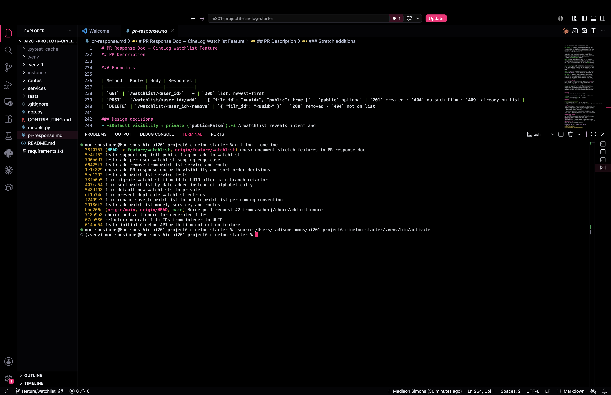

# PR Response Doc — CineLog Watchlist Feature

## AI Usage
I used Claude Code (Opus 4.8) as a pair-programming assistant throughout this
project. Concretely:

- **Orientation:** I had it summarize `models.py`, `collection_service.py`, and
  `test_collection.py` and walk me through `add_to_collection()` — specifically the
  two-layer dedup (service pre-check + DB `UniqueConstraint`) and what it returns
  when the film doesn't exist — before I wrote the equivalent watchlist code. I
  verified each summary against the actual source rather than taking it on trust.
- **Mechanical work:** finding all call sites of `save_to_watchlist` (project-wide
  `grep`, re-run to confirm zero remaining), running the test suite after each
  change, and reconciling the int→UUID references for Comment 6.
- **Stress-testing the design responses (Comments 4 & 5):** after drafting each
  position I asked it to argue the *opposite* side — "what would a careful reviewer
  say against this, and what tradeoff am I ignoring?" For Comment 4 it raised
  *"most users never change defaults, so private-by-default kills discovery."* That
  was real, so I revised the response to meet it head-on (that fact is exactly why
  the sticky default must be the safe one, plus a share-prompt to recover
  discovery). For Comment 5 it raised alphabetical's stability/determinism vs.
  timestamp ties; I'd largely covered the recency argument already, but I added a
  sentence on tie-resolution. The positions and reasoning are my own — AI was the
  adversary I tested them against, not the author.

## Comment 1 — Rename
**What I did:** Renamed `save_to_watchlist()` to `add_to_watchlist()` in
`services/watchlist_service.py` to match the project's `verb_to_noun` service
convention (`add_to_collection`, `remove_from_collection`, `get_collection`).
Updated both call sites in `routes/watchlist/watchlist.py` — the import on line 8
and the invocation in `add_film()`.

**How I verified:** Found every reference with a project-wide search
(`grep -rn "save_to_watchlist" --include="*.py"`), which returned exactly three
hits: the definition plus the import and call in the route. After renaming, I
re-ran the same search and it returned nothing, confirming no call site was
missed. I also imported the app factory (`create_app`) to catch any broken
import, and ran `pytest tests/ -v` — all tests still pass.

## Comment 2 — Deduplication
**What I did:** Followed the same two-layer pattern `add_to_collection()` uses.
(1) In the service, after the film-exists check, I query for an existing
`WatchlistEntry` with the same `user_id` + `film_id`; if one exists I raise a new
`AlreadyOnWatchlistError` (mirroring `AlreadyInCollectionError`) instead of
inserting a second row. (2) As a database-level backstop I added a
`UniqueConstraint("user_id", "film_id", name="unique_user_film_watchlist")` to the
`WatchlistEntry` model, matching the constraint on `CollectionEntry`. The service
check gives a clean, typed error; the constraint guarantees integrity even if a
future code path skips the service. I also wired the error through the HTTP layer:
the seed watchlist route called the service directly, so a duplicate add crashed
with a 500. I wrapped the route in `try/except` mirroring the collection route, so
a duplicate now returns **409 Conflict** and a nonexistent film returns
**404 Not Found** — the dedup fix is now observable end to end, not just in the
service.

**How I verified:** I studied `add_to_collection()` first — its check does
`CollectionEntry.query.filter_by(user_id, film_id).first()` and raises
`AlreadyInCollectionError` (returning nothing new) when a row already exists, so a
duplicate never reaches the `db.session.add`. I then wrote a small script that adds
the same film twice for one user: the first call succeeds, the second raises
`AlreadyOnWatchlistError`, and `WatchlistEntry.query...count()` returns exactly 1.
(This is also covered by an automated test in Comment 3.) Full suite still passes.

## Comment 3 — Missing test
**What I did:** Created `tests/test_watchlist.py`. I used
`test_add_to_collection_nonexistent_film_raises` in `tests/test_collection.py` as
my model: same `app` / `sample_user` / `sample_film` fixtures (in-memory SQLite,
returning IDs), same `with app.app_context()` wrapper, and the same
`with pytest.raises(...)` assertion style. The required test,
`test_add_to_watchlist_nonexistent_film_raises`, passes a UUID-shaped
`fake_film_id` and asserts `add_to_watchlist` raises `FilmNotFoundError` rather
than a database integrity error. I also added
`test_add_to_watchlist_creates_entry` and `test_add_to_watchlist_duplicate_raises`
so the rename (Comment 1) and dedup (Comment 2) are covered by automated tests,
not just a one-off script.

**How I verified:** `pytest tests/test_watchlist.py -v` — 3 passed. Then
`pytest tests/ -v` — 7 passed (4 collection + 3 watchlist), confirming the new
file doesn't interfere with the existing suite.

## Comment 4 — Default visibility
**My position:** New watchlists should default to **private** (`public=False`). I
changed the `WatchlistEntry.public` column default from `True` to `False`. Sharing
becomes an explicit, reversible opt-in rather than an inherited default.

**Reasoning:** I'm optimizing for user trust and the principle of least surprise.
A watchlist is a statement of *intent and taste* — the films someone plans to
watch — and many users treat that as personal (a film-school student's research
list, a user working through therapy-adjacent themes, someone hiding a guilty-
pleasure binge). The two error directions are not symmetric: defaulting to public
and being wrong exposes a list before the user chose to share it, and once a list
has been seen, linked, or indexed, that exposure can't be taken back. Defaulting
to private and being wrong only costs a user one click to flip the toggle. When
the downside of one default is irreversible and the downside of the other is a
minor inconvenience, the safe default is the correct default. This is also the
"privacy by design" posture I'd want CineLog to be able to defend publicly.

**Tradeoff acknowledged:** Private-by-default has a real cost — it slows the
social/discovery loop that makes CineLog more than a personal tracker. Friends
can't stumble onto each other's watchlists, the discovery surface has less content
to work with, and network effects build more slowly. The counterargument (raised
when I stress-tested this) is sharp: *most users never change defaults, so
private-by-default effectively kills discovery for the majority.* I take that
seriously — but it actually reinforces the choice. If most users never touch the
default, the default must be the one that can't hurt them; "most users never
change it" is a reason to make the sticky default the safe one, not the exposed
one. We recover discoverability the right way — a share prompt at list-creation
("Make this public so friends can see it?") and easy per-list toggles — which
drives sharing through an informed choice instead of through exposure nobody
opted into.

## Comment 5 — Sort order
**My position:** I'm implementing the maintainer's preference — default to
**date added, newest first**. I changed `get_watchlist()` from
`.order_by(Film.title.asc())` to `.order_by(WatchlistEntry.date_added.desc())`
(and dropped the now-unnecessary `.join(Film)`).

**Reasoning:** A watchlist is a "saved for later" queue, not a reference catalog.
The dominant user action is *add a film now, come back later to pick something to
watch* — so the most recently added items are the ones the user is still thinking
about and most likely to act on. Alphabetical order actively works against that
loop: a film you just added lands wherever its title falls, so "Zodiac" is buried
at the bottom the moment you save it. Recency-first keeps the freshly-added film
where the user expects it.

There's a second argument the maintainer didn't raise that I think seals it:
**consistency with the rest of the app.** `get_collection()` already returns
newest-first (`CollectionEntry.date_added.desc()`). If the watchlist sorted
alphabetically, a user's two lists would behave by different rules for no reason
the user could predict. Matching the collection's ordering makes both views feel
like the same product.

**Engagement with reviewer's point:** The maintainer's stated reasoning — "most
users want to see what they added recently" — is exactly right for this list type,
and I'm agreeing rather than pushing back. I don't want to dismiss alphabetical
entirely, though: its genuine strength is *locating a specific known title* in a
long list. But that's a lookup need, and a default sort is the wrong tool for it —
it's better served by explicit sort/search controls we can add later (sort-by
dropdown, type-to-filter). Optimizing the *default* for the common browse-and-pick
case while leaving lookup to explicit controls is the right split, and it's the
decision I'm documenting so we don't re-litigate it. (Stress-testing this, the
strongest counter was that alphabetical is stable/deterministic while timestamps
can tie; in practice `date_added` is high-resolution so ties are vanishingly rare,
and a stable secondary key can be layered in if it ever matters.)

## Comment 6 — Rebase
**What conflicted:** The reconciliation the reviewer asked for was real, but it
lived in the *code*, not in a git merge. This branch was cut from a `main` that
already contains the int→UUID refactor commit (`refactor: migrate film IDs from
integer to UUID`), so `git rebase origin/main` had nothing to replay —
`origin/main` was already the merge-base. The actual mismatch the reviewer caught
was that the **watchlist code still assumed integer film IDs** while the rest of
the app had moved to UUIDs:
- `WatchlistEntry.film_id` was declared `db.Integer` (FK to a `Film.id` that is now
  `String(36)`), a real type mismatch that only "worked" earlier because SQLite has
  loose type affinity and quietly stored the UUID string in an integer column.
- The `add_to_watchlist` docstring described `film_id` as `int` ("pre-refactor").
- The `POST /watchlist/<user_id>/add` route documented its body as
  `{ "film_id": <int> }`.

**How I resolved it:** I updated the watchlist code to match main's UUID model:
`WatchlistEntry.film_id` → `db.String(36)`, the docstring → `film_id (str): UUID
of the film`, and the route body doc → `{ "film_id": "<uuid>" }`. I then ran
`git fetch origin` and `git rebase origin/main`; because the branch already sat on
post-refactor main, the rebase was a clean no-op (no conflicts to resolve). I'm
documenting the no-op honestly rather than manufacturing a conflict — the
substantive work was the code reconciliation above.

**How I verified no conflict remains:** (1) `grep` confirmed no `film_id` column
uses `db.Integer` — the only remaining `db.Integer` columns are `Film.year` and
`CollectionEntry.rating`, which are correctly integers. (2) `pytest tests/ -v`
passes (8 tests); the watchlist tests now round-trip UUID `film_id` values through
a `String(36)` column without relying on SQLite's loose typing. (3)
`git log --graph` shows my feature commits form a linear chain on top of
`origin/main` with **no merge commits** among them.

## Stretch — remove_from_watchlist()
**What I did:** Added `remove_from_watchlist(user_id, film_id)`, following the
`remove_from_collection()` pattern exactly: look up the `(user_id, film_id)` entry;
if it doesn't exist raise a new `NotOnWatchlistError` (mirroring
`NotInCollectionError`); otherwise `db.session.delete` it and return `True`. I also
added a `DELETE /watchlist/<user_id>/remove` route that returns **200** on success
and **404** (via `NotOnWatchlistError`) when the film isn't on the list — matching
the collection route's remove endpoint.

**Why / how verified:** The naming (`verb_to_noun`) and the "raise a typed error
instead of silently no-op'ing" convention come straight from the collection
service, so removal behaves the same way a reviewer would already expect. Covered
by `test_remove_from_watchlist_deletes_entry` (add then remove, confirm the row is
gone) and `test_remove_from_watchlist_not_present_raises` (remove when absent →
`NotOnWatchlistError`). Also exercised the route directly: 200 then 404 on a repeat
remove.

## Stretch — additional test (my choice of edge case)
**What I did:** Added `test_watchlist_dedup_is_scoped_per_user`. It adds the same
film to two *different* users' watchlists and asserts both adds succeed and two
independent entries exist.

**Why I chose it:** The dedup fix (Comment 2) rests entirely on the unique key
being `(user_id, film_id)`. The most likely way to break it in a future refactor
is to make the constraint (or the pre-check) key on `film_id` alone — which would
silently stop *any* two users from watchlisting the same film. None of the
review-driven tests would catch that regression, because they all use a single
user. This test pins the per-user scoping down as intended behavior, so the bug
would fail a test instead of shipping.

## Stretch — visibility toggle
**What I did:** Added an optional `public` parameter to `add_to_watchlist(user_id,
film_id, public=None)` and threaded it through the `POST /watchlist/<user_id>/add`
body (`{ "film_id": "...", "public": true }`, `public` optional). When a caller
passes `public`, the entry uses it; when omitted (`None`), the service leaves it
unset so the model's `default=False` (private) applies.

**Why / how verified:** This lets a caller opt a specific list into public
visibility explicitly, without changing the safe default from Comment 4 — and,
importantly, the default still lives in exactly one place (the model column), so
the service doesn't hard-code a second copy of it that could drift. Covered by
`test_add_to_watchlist_public_flag` (explicit `public=True` is honored) and
`test_add_to_watchlist_defaults_private` (omitting it stays `False`). Verified via
the route too: `POST` with `"public": true` returns an entry with `public: true`.

## PR Description

### Overview
Adds a **watchlist** — films a user wants to watch *later* — as a first-class list
alongside the existing collection (films already watched).

- **Model:** `WatchlistEntry` — UUID primary key, `user_id` / `film_id` foreign
  keys, `date_added`, a `public` visibility flag, and a unique `(user_id, film_id)`
  constraint.
- **Service (`watchlist_service.py`):** `add_to_watchlist()`,
  `remove_from_watchlist()`, `get_watchlist()`.

### Endpoints

| Method | Route | Body | Responses |
|--------|-------|------|-----------|
| `GET` | `/watchlist/<user_id>` | — | `200` list, newest-first |
| `POST` | `/watchlist/<user_id>/add` | `{ "film_id": "<uuid>", "public": true }` — `public` optional | `201` created · `404` no such film · `409` already on list |
| `DELETE` | `/watchlist/<user_id>/remove` | `{ "film_id": "<uuid>" }` | `200` removed · `404` not on list |

### Design decisions
- **Default visibility → private (`public=False`).** A watchlist reveals intent and
  taste, and accidental public exposure is irreversible while opting in is one click
  — so the safe default wins. The tradeoff is slower social discovery, which we'd
  recover with an explicit share prompt rather than an exposed default. Callers can
  still opt a specific entry public via the `public` flag. *(Full reasoning under
  "Comment 4 — Default visibility" in this doc.)*
- **Sort order → date added, newest-first.** A watchlist is a "saved for later"
  queue, so recency matches the add-then-browse loop, and it's consistent with how
  `get_collection()` already orders. Alphabetical's real strength (locating a known
  title) belongs in explicit sort/search controls, not the default. *(Full reasoning
  under "Comment 5 — Sort order".)*

### Review feedback addressed
Renamed `save_to_watchlist` → `add_to_watchlist` (naming convention), added
deduplication (`AlreadyOnWatchlistError` + unique constraint, surfaced as `409`),
added the missing nonexistent-film test, documented the two design decisions above,
and reconciled `film_id` to UUID after the main-branch refactor.

### Stretch additions
`remove_from_watchlist()` + its `DELETE` endpoint, an optional `public` flag for
explicit per-entry visibility, and an extra test pinning down per-user dedup scoping.

### How to manually test
From the repo root (with the virtualenv available):

```bash
# 1. Seed a user and a film to work with, printing their IDs
FLASK_APP=app.py .venv/bin/flask shell <<'PY'
from app import db
from models import User, Film
u = User(username="demo", email="demo@example.com")
f = Film(title="Paddington 2", year=2017, genre="Comedy")
db.session.add_all([u, f]); db.session.commit()
print("USER_ID", u.id)
print("FILM_ID", f.id)
PY

# 2. Run the app (in another terminal)
FLASK_APP=app.py .venv/bin/flask run
```

Then, substituting the IDs printed in step 1:

```bash
USER=<USER_ID>; FILM=<FILM_ID>

# a) Add a film -> 201, and note "public": false in the response (private default)
curl -sX POST localhost:5000/watchlist/$USER/add \
     -H 'Content-Type: application/json' -d "{\"film_id\":\"$FILM\"}"

# b) View the watchlist -> array containing the film (newest-first ordering)
curl -s localhost:5000/watchlist/$USER

# c) Add the SAME film again -> 409 Conflict (deduplication)
curl -isX POST localhost:5000/watchlist/$USER/add \
     -H 'Content-Type: application/json' -d "{\"film_id\":\"$FILM\"}" | head -1

# d) Add a nonexistent film -> 404 Not Found
curl -isX POST localhost:5000/watchlist/$USER/add \
     -H 'Content-Type: application/json' \
     -d '{"film_id":"00000000-0000-0000-0000-000000000000"}' | head -1

# e) (stretch) Add with explicit public flag -> 201, "public": true
curl -sX POST localhost:5000/watchlist/$USER/add \
     -H 'Content-Type: application/json' -d "{\"film_id\":\"$FILM\",\"public\":true}"

# f) (stretch) Remove the film -> 200; removing again -> 404
curl -isX DELETE localhost:5000/watchlist/$USER/remove \
     -H 'Content-Type: application/json' -d "{\"film_id\":\"$FILM\"}" | head -1
```

Automated coverage: `.venv/bin/python -m pytest tests/ -v` → 13 passing
(4 collection + 9 watchlist).

### Commit history
Clean, conventional, one logical change per commit, no merge commits
(rebased on `main`). `git log --oneline` (short hashes will differ after the
final amend/push — screenshot the live output):

```
docs: document stretch features in PR response doc
feat: support explicit public flag on add_to_watchlist
test: add per-user watchlist scoping edge case
feat: add remove_from_watchlist service and route
docs: add PR response doc with visibility and sort-order decisions
test: add watchlist service tests
fix: migrate watchlist film_id to UUID after main branch refactor
fix: sort watchlist by date added instead of alphabetically
fix: default new watchlists to private
fix: prevent duplicate watchlist entries
fix: rename save_to_watchlist to add_to_watchlist per naming convention
feat: add watchlist model, service, and routes
```


